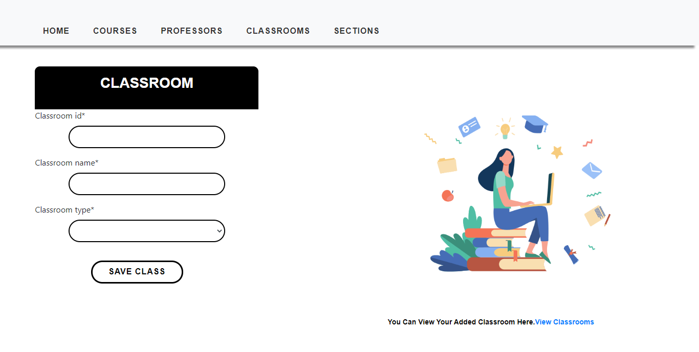
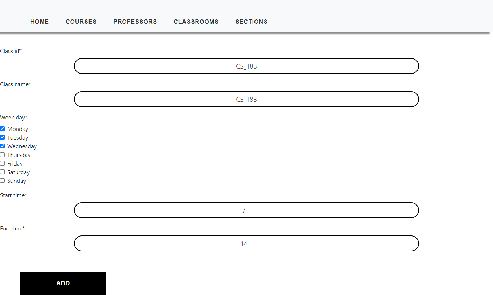
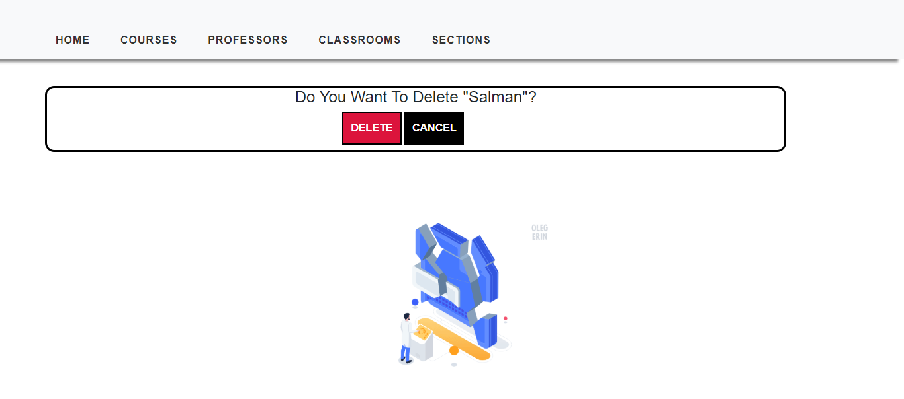

# Timetable Generator Web-Application

###### This was project with .

This is the Activity Scheduling Project which will generate the timetable of different sections for user with required inputs.

## Configuration Setup
<b>Project Configuration Guidelines(Step by Step):</b>

To run this project on your local server, follow the following steps:
* Install Python 3.8 on your Computer from the official website.
* Install Django on your computer by running this command 
                      
                      pip install Django(For windows)   
                      python -m pip install Django(For Mac/Linux)

* Install Django Crispy Forms by running this command:

                      pip install django-crispy-forms
* Install Django Multi select fields on your computer:

                      pip install django-multiselectfield
* If you don’t have Git Bash/Git Bucket on your computer. Then install it first.
* Run this command on your git terminal

                      git clone “https://github.com/pammi1307/Time-Table-Generator.git”
* After clonning the repository in your computer, run the command:

                      cd ActivitySelectionTimetable
* Run this command to run server on your localhost:8000

                       python manage.py runserver
- App is running on your Computer now. Enjoy!!!

## Alogrithm
When first we started the project we chosed the Greedy algorithm to perform for our project but as days went by, we could not complete it in greedy way so the most suitable approach we reached, was <b>Randomized Brute Force</b> as some of the values generated in algorithm was random in order to fulfill the requirements. This algorithm is connected with the database in the back-end where the data saved in the database will be passed through the algorithm to generate the timetable. Our Algorithm on the console is just working perfectly but as we were learning the python and Django for the first time so that got us into the problem to connect the database with the algorithm but we are working on it untill we have time.

## Features
1. User-Friendly GUI which helps you upload data on the go.
2. You can generate timetable for one class at a time.
3. You can download the PDF file of the timetable.
4. A responsive app which can be used in any device.

## Quick Demo   

## Desktop View

## Mobile View

## Timetable

## Course Interface

## Professor Interface

## Classroom Interface

## Class(Section) Interface

## View Table Interface

## Update Page Interface

## Delete Page Interface

